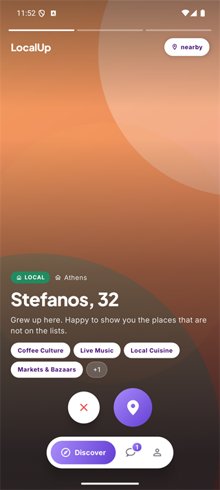
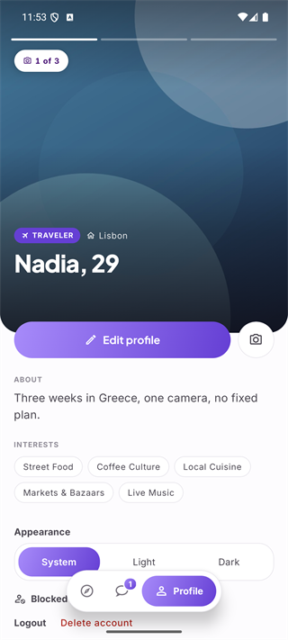
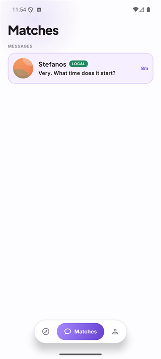
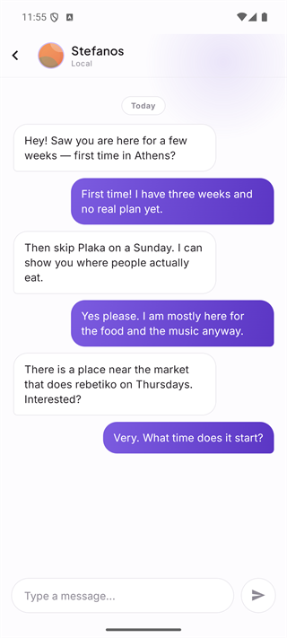

# LocalUp

> **In closed testing on Google Play** (approved 2026-09-20). LocalUp is built
> solo as a university thesis — architecture, app and backend. Every flow below
> works end to end on real devices; the remaining gaps are listed under
> *Status & scope*.

**LocalUp connects travelers with locals in the same city.** Not a dating app —
think "Bumble meets Airbnb's editorial style": clean, curated, trust-oriented.
It's about meeting real people in a place, not hookups.

## The core idea

Every user has two locations: a **home base** (where they live) and a **current
location** (where they are right now). From these, the app derives your **mode**:

- **LOCAL** — you're near your home base.
- **TRAVELER** — you're more than ~50 km from home.

The whole product in one sentence: **you only see people in the opposite mode
near you.** A traveler in Athens sees locals in Athens; a local in Athens sees
travelers currently passing through. That opposite-mode pairing is the core
invariant — it's what makes *"I want to meet locals when I travel"* and *"I want
to meet interesting travelers in my city"* the same product.

## Screenshots

| Discover | Profile | Matches | Chat |
|---|---|---|---|
|  |  |  |  |

Both people above are demo accounts and the photos are generated artwork — no
real user's pictures, names or coordinates appear anywhere in this repository.
Note the badges: the traveler's deck shows **LOCAL** cards, and her own profile
reads **TRAVELER**. That is the whole product in two labels.

## What you can do today

- **Sign up & build a profile** — email/password or Google sign-in; name, bio,
  interests, date of birth, optional beliefs, and up to six photos. One is enough
  to finish; the first is the one people see first, and the order is yours to
  change.
- **Get placed automatically** — the app reads your location and assigns your
  mode (local vs. traveler).
- **Discover** — swipe through a deck of opposite-mode people near you. Each card
  shows their mode badge, home city, bio, and shared interests.
- **Filter** — distance and age, with a live count of who a setting would show
  and a suggested radius when yours is too narrow.
- **Match** — a mutual like creates a match; the other side never learns about a
  one-sided like.
- **Chat** — matched users get a realtime thread, with unread badges and push
  notifications for new matches and messages.
- **Stay safe** — unmatch, block (silent, both directions) and report from any
  match's profile; delete your account from Settings.

### How the deck is built

Ranking happens entirely in Postgres, in one `discover_candidates` call. The
query filters first — opposite mode, inside your distance and age range, not
already swiped, neither side blocked — narrowing by PostGIS proximity
(`ST_DWithin` plus a KNN `<->` ordering) before scoring anything. Only then are
the survivors scored:

| Signal | Weight | How it is measured |
|---|---|---|
| Shared interests | 10 | how many of *your* interests they share |
| Distance | 5 | linear decay across your maximum radius |
| Activity recency | 3 | how recently their location was updated, over a 14-day window |
| Shared language | 2 | any overlap at all |
| Political affinity | 3 | distance along a left–right axis; unanswered scores 0.5, not 0 |
| Religious affinity | 3 | same or not; unanswered scores 0.5, not 0 |

Those weights live in a `match_weights` table rather than in the function body,
so the ranking can be retuned with an `UPDATE` — no migration, no redeploy, and
no app release. The scoring is deliberately the only tunable part; the
opposite-mode rule is a hard filter, never a weight.

## Tech stack

| Layer      | Choice |
|------------|--------|
| App        | React Native + [Expo](https://expo.dev) SDK 54 (New Architecture) |
| Navigation | [Expo Router](https://docs.expo.dev/router/introduction/) (file-based) |
| State      | Redux Toolkit + [TanStack Query](https://tanstack.com/query) |
| UI         | React Native Paper |
| Backend    | [Supabase](https://supabase.com) — Postgres, Auth, Storage, Realtime |
| Logic      | Postgres RPCs (`SECURITY DEFINER`/`INVOKER`) + Row-Level Security |
| i18n       | i18next — English shipped; Greek translation complete, not yet switched on |
| Push       | Expo Push → FCM, triggered from Postgres via `pg_net` + an Edge Function |

Sensitive/multi-step operations (mutual-match resolution, onboarding, the matches
overview) run as **Postgres functions**, so they're atomic and enforced at the
database layer rather than composed on the client.

Row-Level Security is enabled on every application table, and the `SECURITY
DEFINER` functions take the caller's identity from `auth.uid()` rather than from
a parameter — so there is no argument a client could point at somebody else's
data. Where RLS cannot reach, column grants do: a policy can say *which rows*
you may write but not *which columns*, so the columns the server owns — the
denormalised interest cache the deck is scored on, the onboarding gate — are
simply not granted to clients at all.

## Project structure

```
src/
  app/          # Expo Router routes (auth, tabs, chat, onboarding)
  features/     # feature modules (matches, chat, discover…) — slices + hooks + i18n
  shared/       # shared components & hooks
  providers/    # AppProviders (Redux → Theme → Paper → SafeArea → AppGuard)
  theme/        # colors, spacing, Paper themes
  config/       # Supabase client, i18n
```

## Release

Native builds go through EAS Build to Google Play; JavaScript-only changes ship
over the air through EAS Update on the `production` channel, pinned to the
native fingerprint. The public pages Google Play requires — privacy policy,
community guidelines and child-safety standards, account deletion — are served
from [`docs/`](docs/) via GitHub Pages. A scheduled workflow pings the
database every other day so the free-tier project does not pause between real
users.

## Roadmap

- [ ] Switch the Greek translation on (one line, after a pass over every screen
      with the longer strings)
- [ ] Declare only approximate location on Android, so the system never offers
      an upgrade to precise
- [ ] Retry push-token registration with backoff when Play Services refuse it
- [ ] Notify the admin on every new user report
- [ ] "Plan ahead" — declare a future trip and be discoverable in that city
      before arriving

## Status & scope

This is a thesis MVP in closed testing: auth, profiles, location-based discovery
with a swipe deck, opposite-mode filtering, mutual matching, realtime chat, push
notifications, block/report and account deletion all work and have been
verified end-to-end on real devices. Android only for now — the code is shared,
the iOS build has not been exercised. It is **not** production-hardened.

## License

Built for academic purposes. No license is granted for commercial use at this time.
